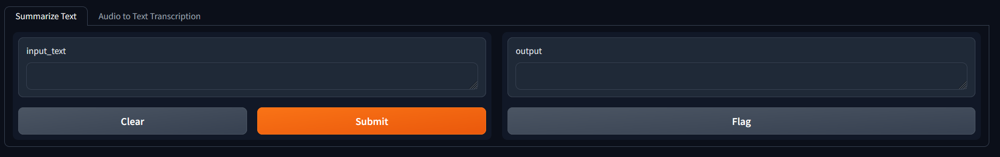

# Python Hugging Face Examples
These are some fairly simply short pieces of Python code to run Hugging Faces models in a local Gradio interface, showing individual and multi-tabbed options

I use a env key value, so if you want to follow along please create this key

There is a requirments key that you can use for Python, all Python code was developed in Python 3.11

